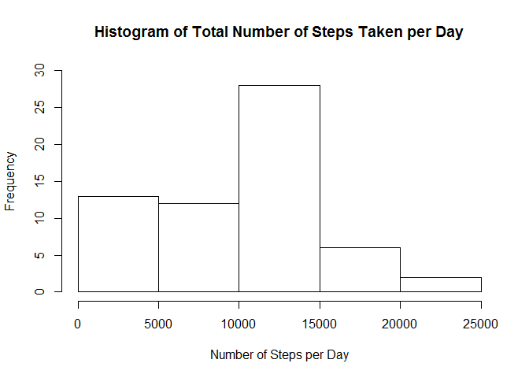
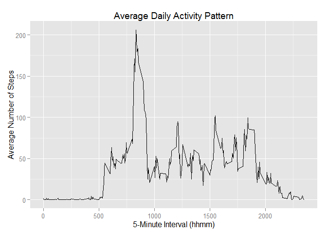
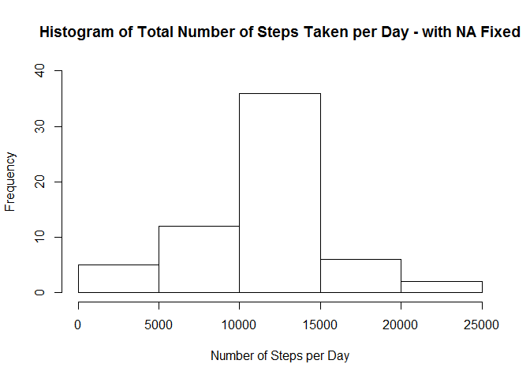
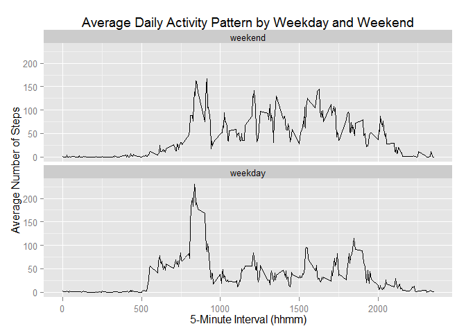

# Reproducible Research: Peer Assessment 1

```r
## Set knitr global settings
require(knitr)
require(ggplot2)
opts_chunk$set(echo=TRUE, results="markup", warning=FALSE, message=FALSE)
```


## Loading and preprocessing the data

```r
if (!file.exists("activity.csv")) {
    unzip("activity.zip")
}
activity <- read.csv("activity.csv", na.strings = "NA")
activity$steps <- as.numeric(activity$steps)
```


## What is mean total number of steps taken per day?


```r
## Calculate the sum of steps by day
activityByDays <- aggregate(list(totalSteps = activity$steps), 
                            by=list(day=activity$date), 
                            FUN="sum", na.rm = TRUE)
hist(activityByDays$totalSteps,
     ylim = range(0:30),
     xlab = "Number of Steps per Day",
     main = "Histogram of Total Number of Steps Taken per Day")
```

 


```r
## Calculate the means
meanNumSteps <- mean(activityByDays$totalSteps, na.rm=TRUE)
meanNumSteps <- as.integer(round(meanNumSteps, digits = 0))

## Calculate the medians
medianNumSteps <- median(activityByDays$totalSteps, na.rm=TRUE)
medianNumSteps <- as.integer(round(medianNumSteps, digits = 0))
```


The mean total number of steps taken per day is 9354.

The median total number of steps taken per day is 10395.


## What is the average daily activity pattern?

```r
## Average number of steps by interval
activityByIntervals <- aggregate(list(avgSteps = activity$steps), 
                          by=list(interval=activity$interval),
                          FUN="mean",
                          na.rm=TRUE)

plotDaily <- ggplot(activityByIntervals, aes(x=interval, y=avgSteps)) +
             theme_gray() +
             geom_line() +
             xlab("5-Minute Interval (hhmm)") +
             ylab("Average Number of Steps") +
             ggtitle("Average Daily Activity Pattern")
print(plotDaily)
```

 

```r
## The interval with max number of steps
maxStepsInterval <- activityByIntervals[activityByIntervals$avgSteps
                                    ==max(activityByIntervals$avgSteps),][1]
```


The 5-minute interval, on average across all the days in the dataset, having the maximum number of steps is 835.


## Imputing missing values

```r
numberOfMissings <- sum(is.na(activity$steps))
```


The number of missing step values is 2304.

The missing values will be replaced by the daily averages of corresponding intervals. These averages have been calculated for the plot of daily activity pattern.


```r
## Replace the missing value at one interval
## with the average of that interval
activityFixedNA <- activity
intervals <- activityByIntervals$interval
for (i in 1:length(activityFixedNA$steps)) {
    if (is.na(activityFixedNA$steps[i])) {
        thisInterval <- activityFixedNA$interval[i]
        activityFixedNA$steps[i] <- activityByIntervals[
                                        intervals==thisInterval,][[2]]
    }
}

## Hitogram of the activity with NA fixed
activityFixedNAByDays <- aggregate(list(totalSteps = activityFixedNA$steps), 
                            by=list(day=activityFixedNA$date), 
                            FUN="sum", na.rm = TRUE)
hist(activityFixedNAByDays$totalSteps,
     ylim = range(0, 40),
     xlab = "Number of Steps per Day",
     main = "Histogram of Total Number of Steps Taken per Day - with NA Fixed")
```

 

```r
## Calculate the means with NA fixed
meanNumStepsFixedNA <- mean(activityFixedNAByDays$totalSteps, na.rm=TRUE)
meanNumStepsFixedNA <- as.integer(round(meanNumStepsFixedNA, digits = 0))

## Calculate the medians with NA fixed
medianNumStepsFixedNA <- median(activityFixedNAByDays$totalSteps, na.rm=TRUE)
medianNumStepsFixedNA <- as.integer(round(medianNumStepsFixedNA, digits = 0))
```


The mean total number of steps taken per day after fixing missing values is 10766 compared with 9354 before the fix.

The median total number of steps taken per day after fixing missing values is 10766 compared with 10395 before the fix.

Replacing the missing values with the corresponding interval averages reduces the left-skewedness of the histogram and moves the mean total of steps towards the median total of steps.


## Are there differences in activity patterns between weekdays and weekends?

```r
## Activity by weekday and weekend
activityFixedWday <- activityFixedNA
activityFixedWday$day <- weekdays(as.Date(activityFixedWday$date))
activityFixedWday$day <- factor(activityFixedWday$day, 
                            levels = c("Monday", "Tuesday", "Wednesday",
                                       "Thursday", "Friday",
                                       "Saturday", "Sunday"))
levels(activityFixedWday$day) <- c("weekday", "weekday", "weekday",
                                   "weekday", "weekday",
                                   "weekend", "weekend")
activityFixedWday$day <- relevel(activityFixedWday$day, "weekend")

## Average number of steps by interval and weekdays
activityFWByIntervals <- aggregate(list(avgSteps = activityFixedWday$steps), 
                            by=list(interval=activityFixedWday$interval,
                                    day=activityFixedWday$day),
                            FUN="mean",
                            na.rm=TRUE)

plotWday <- ggplot(activityFWByIntervals, aes(x=interval, y=avgSteps)) +
    theme_gray() +
    facet_wrap(~day, ncol = 1) +
    geom_line() +
    xlab("5-Minute Interval (hhmm)") +
    ylab("Average Number of Steps") +
    ggtitle("Average Daily Activity Pattern by Weekday and Weekend") +
    guides(color = FALSE)

print(plotWday)
```

 


The weekday and weekend activity patterns show two main differences. There are more activities in the period between 5:00 and 8:00 in the weekday pattern than in the weekend one. One possible explanation is this person wakes up later during weekend. There are less activities in the period between 10:00 and 17:00 in the weekday pattern than in the weekend one. One possible explanation is that this person's work may not involve much movement during weekdays.
